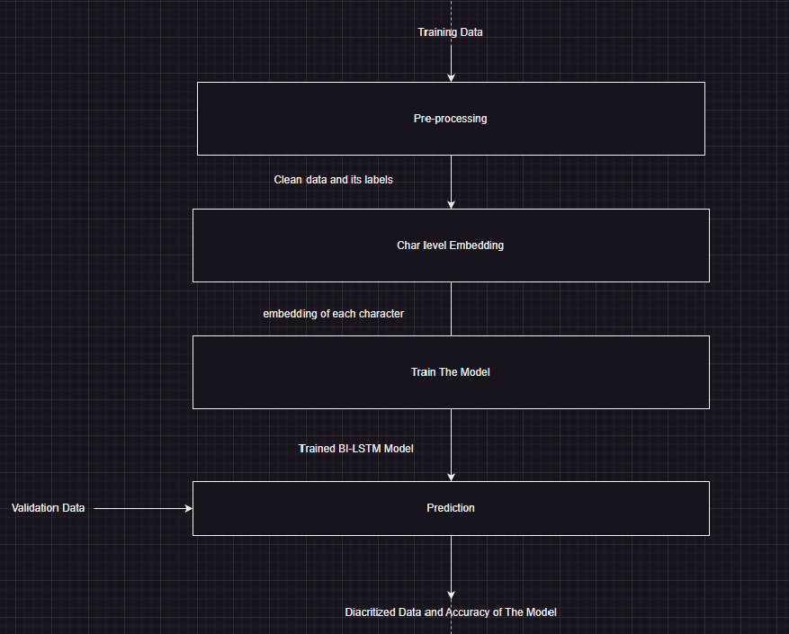
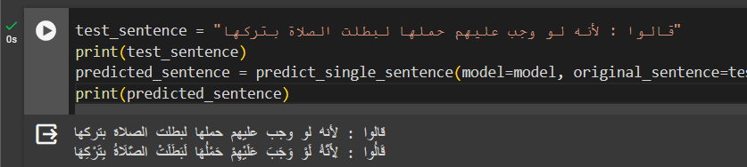
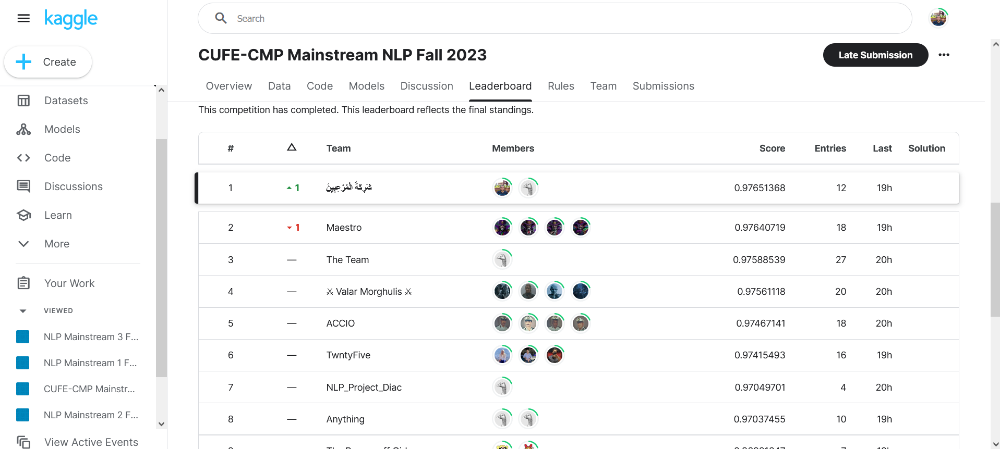
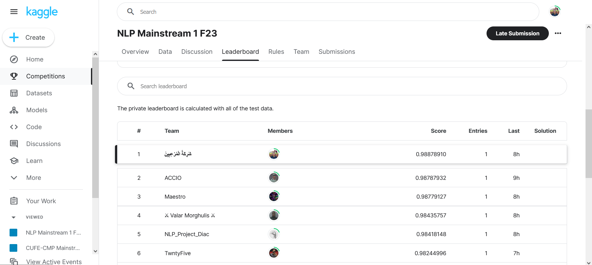
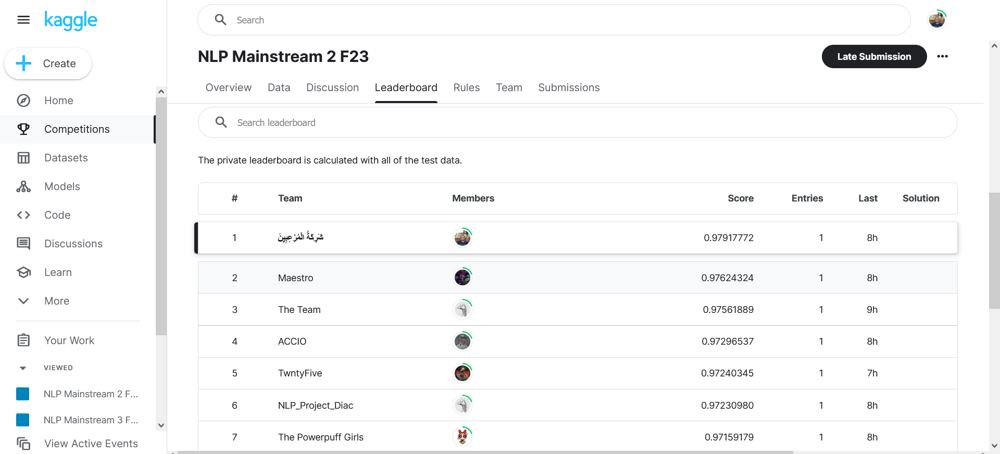
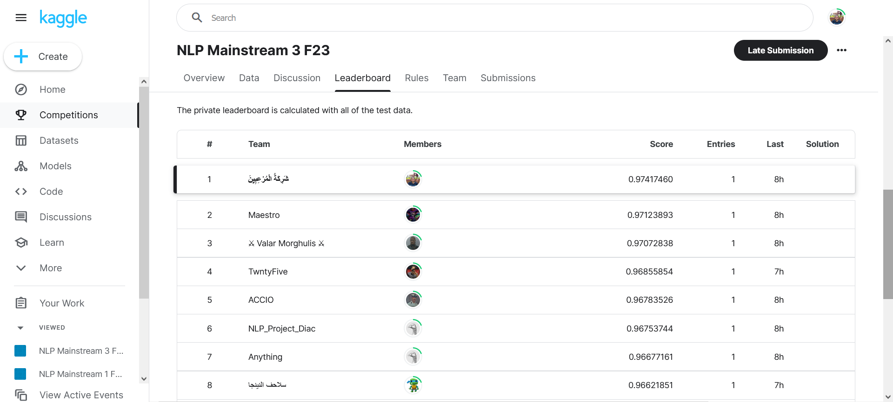

<h3 align="center">Arabic Text Diacritization</h3>

---

 This competition project is focused on the task of Arabic Text Diacritization. It uses state-of-the-art Natural Language Processing (NLP) techniques to add diacritical marks to Arabic text. These marks are crucial for correctly interpreting and pronouncing Arabic words. The project includes a comprehensive pipeline for preprocessing the text, training the diacritization model, and testing its accuracy on test set.

## 📝 Table of Contents

- [About](#about)
- [Pipeline](#pipeline)
- [Preprocessing](#preprocessing)
- [Char Level Embedding](#char-level-embedding)
- [Training](#training)
- [Testing and Accuracy](#testing-and-accuracy)
- [competition Results](#competition-results)

## 🧐 About 

This project implements a BiLSTM (Bidirectional Long Short-Term Memory) model for diacritic restoration in Arabic text. The goal is to predict diacritics for each character in a given text.
 
 
One could consider it as a classification problem on char-level with 14 classes (no diacritics, fath, damm, ...).

## Pipeline 

## Preprocessing 
  * The code includes several functions for cleaning and preprocessing the input text data. These functions perform tasks such as removing unwanted characters, diacritics, and normalizing the text.
  * The preprocessing involves replacing or removing specific patterns using regular expressions, cleaning unwanted characters, and handling diacritics.
  * The code tokenizes the cleaned data into sentences without cutting words.
  * It loads the data, cleans it, and saves it to files. Then, it tokenizes the data and converts it to indices using character-to-index mapping.
  * Data loaders are created using PyTorch's DataLoader to facilitate batch processing during training.

## Char Level Embedding 
  * The code uses PyTorch Embedding to embed Arabic characters as a first layer in the used Bi-LSTM network.

## Training 
  * The main model in the code is a character-level Bidirectional Long Short-Term Memory (BiLSTM) network, implemented as the CharLSTM class.
  * The model consists of an embedding layer, a bidirectional LSTM layer, batch normalization, and an output layer.
  * The LSTM layer is designed to capture contextual information from both forward and backward directions.
  * Batch normalization is applied to normalize hidden states.
  * The output layer produces predictions for diacritic labels.
  * The training loop iterates through epochs, batches, and sequences to train the model.
  * CrossEntropyLoss is used as the loss function, and Adam optimizer is employed for parameter updates.
  * The learning rate is adjusted with a scheduler during training.
  * The code includes training and validation phases, tracking loss and accuracy (on training set, and validation set).

## Testing and Accuracy 
  * The code includes a function (predict_test) to load a pre-trained model and generate submission.csv file with diacritic index for every char.
  * There's a function (predict_single_sentence) to predict the diacritics for a sentence and return it as diacritized.
  * We have achieved average accuracy of 97.78% using multiple test sets.
  * Here is a demo to diacritize a single sentence:
    

## competition Results 
* A competition was held by our college on Kaggle, with 4 different test sets, with 20 competing teams.
* Our team (شَرِكَةُ الْمُرْعِبِيِنَ) has achieved the first position at all the 4 competitions!
* <a href="https://www.kaggle.com/competitions/cufe-cmp-mainstream-nlp-fall-2023/leaderboard">First competition</a>:
  
* <a href="https://www.kaggle.com/competitions/nlp-mainstream-1-f23/leaderboard">Second competition</a>:
  
* <a href="https://www.kaggle.com/competitions/nlp-mainstream-2-f23/leaderboard">Third competition</a>:
  
* <a href="https://www.kaggle.com/competitions/nlp-mainstream-3-f23/leaderboard">Fourth competition</a>:
  